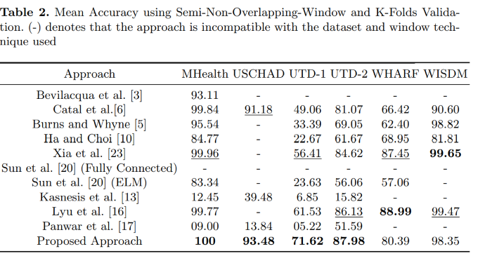

## Overview
This github is an implementation for accepted manuscript titled `Human Activity Recognition using Wearable Sensors: Review, Challenges, Evaluation Benchmark`.

Recognizing human activity plays a significant role in the advancements of human-interaction applications in healthcare, personal fitness, and smart devices. Many papers presented various techniques for human activity representation that resulted in distinguishable progress.

In this study, we conduct an extensive literature review on recent, top performing techniques in human activity recognition based on wearable sensors. Due to the lack of standardized evaluation and to assess and ensure a fair comparison between the state-of-the-art techniques, we applied a standardized evaluation benchmark on the state-of-the-art techniques using six publicly available data-sets: MHealth, USCHAD, UTDMHAD, WISDM, WHARF, and OPPORTUNITY. Also, we propose an experimental, improved approach that is a hybrid of enhanced handcrafted features and a neural network architecture which outperformed top-performing techniques with the same standardized evaluation benchmark applied concerning MHealth, USCHAD, UTD-MHAD data-sets.

## Contribution
Our work is reflected in the following contributions:

1. Extensive Literature review for recent, top-performing techniques in human
activity based on sensor data

2. Due to different evaluation methodologies, it is hard to achieve a fair comparison between recent techniques. Therefore, we applied a `standardized evaluation` benchmark on the recent works using `six` publicly available datasets with 3 different temporal windows techniques: `Full-Non-Overlapping`, `SemiNon-Overlapping`, and `Leave-One-Trial-Out`.
3. Implementation, training, and re-evaluation of the recent literature work using the proposed standardized evaluation benchmark so all techniques follow
the same experimental setup to ensure a fair comparison.
4. Proposal of an experimental, hybrid approach that combines enhanced feature extraction with neural networks, and evaluation using the proposed
evaluation benchmark criteria, achieving a competitive accuracy.

## Standardized Evaluation Benchmark
Recent approaches implemented, trained and re-evaluated alongside our hybrid approach to follow the same experimental setupusing a standardized benchmark: 6 publicly available data-sets and 3 temporal window techniques.

### Open Source Datasets Used
1. MHealth
2. USC-HAD 
3. UTD-MHAD 
4. WISDM 
5. WHARF
6. OPPORTUNITY

### Supported Checklist Temporal Window Generation Technique for datasets

Datasets Google drive link with supported Temporal Window Generation can be accessed through this [link](https://drive.google.com/drive/folders/1iEx-9qrV3sptYqKlR36nPg1fCjC2JzPe?usp=sharing)

## Evaluation Metric
We conducted our experiments using Google colab with 1xTesla T4 GPU, 2496 CUDA cores, and 12GB GDDR5 VRAM. In
our study, mean accuracy is taken into account as an evaluation criterion for results.

## Results

We conducted three kinds of experiments based on the validation technique used:
1. `K-Folds Validation Experiment`
For the first experiment, top-performing approaches alongside our proposed approach are being evaluated via the K-Folds
validation technique. We conduct our experiment using: MHealth, USCHAD, UTD-1, UTD-2, WHARF, and WISDM data-sets, concerning 3 generation techniques 
discussed earlier.

2. `Leave-One-Subject-Out Experiment`
In this experiment, the same set-up is used as in the K-Folds experiment. The difference in this experiment is that the
evaluation is conducted via the Leave-One-Subject-Out validation technique for the Semi-Non-Overlapping-Window sample generation technique only.

3. `Hold-Out Validation Experiment`
In this experiment, we investigated the effect of different hyper-parameters on our proposed approach via Hold-Out validation. Two variants of our proposed model were introduced: Proposed Approach V1 and Proposed Approach V2. Proposed Approach V1 training was set for 250 epochs; meanwhile, Proposed Approach V2 was set for 200 epochs. This experiment is divided into two separate trials:

